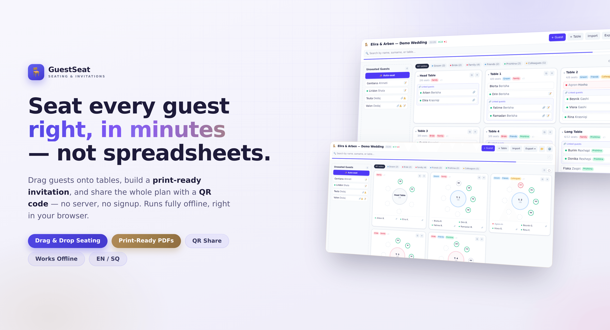

# GuestSeat 🪑💍



**GuestSeat** is a web app for planning wedding (or any event) table seating from a guest-list JSON file. Drag guests onto tables, build a print-ready invitation, and share the whole plan with a QR code — no server, the entire list travels inside the link. It runs fully offline, right in your browser.

🔗 **Live:** [**guestseat.rilindkycyku.dev**](https://guestseat.rilindkycyku.dev)

> All screenshots use the built-in **demo list** (Elira & Arben — Demo Wedding), so no real guest data is shown.

---

## ✨ Features

| Feature | Description |
| :--- | :--- |
| **📥 Import** | Load a guest list JSON — the "grouped by letter" shape (`{ "A": ["Name1", ...] }`), a flat array of names/objects, or a previously exported GuestSeat file (round-trip). |
| **🚀 Onboarding** | If no data is loaded yet, the app prompts you to upload a JSON file, view an example, or download an example template. |
| **🪑 Seating board** | Drag guests from the unseated list onto tables (or back), with per-table capacity limits. Click a guest to edit their name/surname/notes or reassign their table from a dropdown. |
| **👤 Guests** | Only a first name is required — surname is optional, and the name is always the primary identifier. |
| **🔎 Search** | Filter by name, surname, or table name/number. |
| **💌 Invitation** | Fill in bride & groom, venue, location, date/time, a schedule and a message, then download a print-ready **invitation PDF** in three designs — **Classic**, **Modern** or **Romantic**. The schedule is illustrated with vector icons matched by keyword. No QR code on the invitation — it shouldn't expose the whole guest list to whoever receives it. |
| **📱 Share & QR** | Share the whole event via a link (no server — the state lives in the URL), or show a **QR code** guests can scan. A compact index-based, gzip-compressed, base42-packed encoding fits a ~500-guest list into a single QR; larger lists fall back to the native share sheet, a one-tap WhatsApp button, or copy-to-clipboard. |
| **📤 Export** | **JSON** (full, re-importable), **PDF** (a gold-framed cream seating chart with per-part pages, a share QR and a branded footer), and **Excel** (`.xlsx`) — a styled charcoal-and-gold ExcelJS workbook with *Guests* and *Tables* sheets. |
| **💾 Persistence** | Seating state is saved to `localStorage` automatically. |

---

## 📸 Screenshots


| Onboarding | Seating board |
| :---: | :---: |
|  |  |
| **Floor plan** | **Guest editor** |
|  |  |
| **Invitation** | **QR share** |
|  |  |
| **Overview & stats** | **Export menu** |
|  |  |
| **Settings** | **Dark mode** |
|  |  |

### 📱 On mobile


### 📄 Exports

The real, print-ready invitation and seating-chart PDFs:


---

## 🛠️ Development

```bash
npm install
npm run dev
```

## 📦 Build

```bash
npm run build
npm run preview
```

---

*Made with ❤️ by [Rilind Kyçyku](https://github.com/rilindkycyku)*
