# GuestSeat 🪑💍

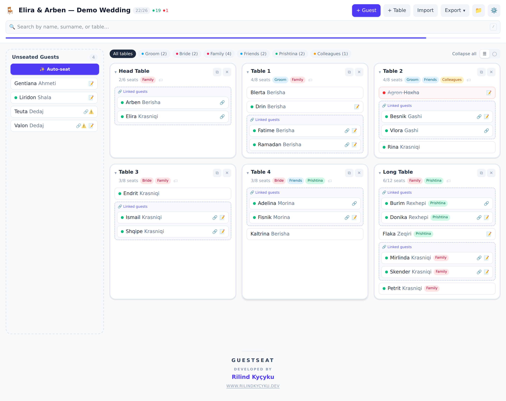

**GuestSeat** is a web app for planning wedding (or any event) table seating from a guest-list JSON file. Drag guests onto tables, build a print-ready invitation, and share the whole plan with a QR code — no server, the entire list travels inside the link. It runs fully offline, right in your browser.

🔗 **Live:** [**guestseat.rilindkycyku.dev**](https://guestseat.rilindkycyku.dev)

> All screenshots use the built-in **demo list** (Elira & Arben — Demo Wedding), so no real guest data is shown.

---

## ✨ Features

| Feature | Description |
| :--- | :--- |
| **📥 Import** | Load a guest list JSON — the "grouped by letter" shape (`{ "A": ["Name1", ...] }`), a flat array of names/objects, or a previously exported GuestSeat file (round-trip). |
| **🚀 Onboarding** | If no data is loaded yet, the app prompts you to upload a JSON file, view an example, or download an example template. |
| **🪑 Seating board** | Drag guests from the unseated list onto tables (or back), with per-table capacity limits. Click a guest to edit their name/surname/notes or reassign their table from a dropdown. Fully keyboard-operable: <kbd>Space</kbd> picks a guest up, arrow keys move between tables, <kbd>Space</kbd> seats them, <kbd>Esc</kbd> cancels. |
| **👤 Guests** | Only a first name is required — surname is optional, and the name is always the primary identifier. Guests can be **linked** (must sit together) or **kept apart** (must not share a table); auto-seating honours both, and seating a kept-apart pair together by hand is flagged rather than blocked. |
| **✨ Auto-seat** | Fills the tables in one undoable step, keeping linked parties together, feuding guests apart, and clustering by group tag. When someone can't be placed it says who, grouped by family, and whether the problem was space or a keep-apart. |
| **🔎 Search** | Filter by name, surname, or table name/number. |
| **💌 Invitation** | Fill in bride & groom, venue, location, date/time, a schedule and a message, then download a print-ready **invitation PDF** in three designs — **Classic**, **Modern** or **Romantic**. The schedule is illustrated with vector icons matched by keyword. No QR code on the invitation — it shouldn't expose the whole guest list to whoever receives it. |
| **📱 Share & QR** | Share the whole event via a link (no server — the state lives in the URL), or show a **QR code** guests can scan. A compact index-based, gzip-compressed, base42-packed encoding fits a ~500-guest list into a single QR; larger lists fall back to the native share sheet, a one-tap WhatsApp button, or copy-to-clipboard. |
| **🔎 Find your seat** | The QR comes in two flavours: the full plan (for a co-planner) or a **guest link** that opens a read-only "type your name, see your table" lookup — nothing saved, nothing editable, and no names listed until someone types. |
| **📤 Export** | **JSON** (full, re-importable — every field round-trips), **PDF** (a gold-framed cream seating chart with per-part pages, a share QR and a branded footer), **table cards** and **place cards** (folded tent cards, one per guest, four to a page), and **Excel** (`.xlsx`) — a styled charcoal-and-gold ExcelJS workbook with *Guests* and *Tables* sheets. The board itself also prints cleanly with <kbd>Ctrl</kbd>+<kbd>P</kbd>. |
| **💾 Persistence** | Every event is saved automatically to **IndexedDB**, so a planner can keep several events side by side and reopen the last one they had open. Lists saved by older versions are migrated from `localStorage` on first run. |
| **🗄️ Backup** | One file with **every** saved event — the copy that survives a cleared browser or a new laptop. Restore puts the browser back to exactly what the file holds; *Add from file* only brings in events you don't already have, so an old backup can't undo newer work. |
| **☁️ Sync** | Optional two-way sync across your devices through **a Supabase project you own**, merging per guest and per table — two people can edit the same wedding at once. See below. |

---

## 📖 Using GuestSeat

The same guide is **inside the app**, and better there: Settings → Guide (or the 📖 button on the
first screen) opens a searchable page with one entry per screen, grouped, each with numbered steps
and a button that opens the screen it describes. A planner on a phone the week before the wedding
never has to come here for it.

### 1. Your first event

The app opens on three ways to begin, and whichever you pick becomes a saved event you can close
and reopen later. It keeps as many events as you like, side by side (📁 in the header, or
Settings → Switch event).

1. **Import a guest list** you already have — see below for the shapes it reads.
2. **Start blank** and type names as you go, choosing the kind of event first (wedding, engagement,
   birthday…), which sets the wording and the invitation defaults.
3. **Load the demo list** to look around with realistic data before touching your own.

Rename the event any time by tapping its title in the header.

### 2. Bringing a guest list in

A guest needs only a first name; everything else is optional and can be filled in later. Import
accepts:

| Shape | Looks like | Becomes |
| :--- | :--- | :--- |
| Grouped | `{ "A": ["Ana", "Besnik"], "B": [...] }` | one table per key, guests seated at it |
| Flat | `["Ana Hoxha", { "name": "Besnik", "table": "t1" }]` | an unseated list |
| A GuestSeat export | the file this app writes | everything back, tags and invitation included |
| CSV | a header row with name/surname/table | the same as a flat list |

Importing into an event already open asks whether to **replace** the list or **add** to it. Adding
merges the two tag palettes, so lists made separately don't fight over the same tag id.

### 3. Seating people

Drag a guest from the unseated panel onto a table, or back out to unseat them. A full table refuses
new guests and says so — capacity is yours to change.

It is fully keyboard-operable, which is faster for a long list:

- <kbd>Space</kbd> picks a guest up, arrow keys move between tables, <kbd>Space</kbd> seats them,
  <kbd>Esc</kbd> cancels.
- <kbd>/</kbd> or <kbd>⌘K</kbd> / <kbd>Ctrl-K</kbd> jumps to search from anywhere; the board scrolls
  to the first match.

Two views seat the same way: a list of tables, or a floor plan of round and long tables.

### 4. What you can record about a guest

Tap a guest for their card: name, surname, note, table, attendance (coming / not coming / pending)
and meal. Two more relationships drive the auto-seating:

- **Linked** — they must sit together. Linking someone unseated to someone seated seats them at once.
- **Kept apart** — they must not share a table. Seating them together by hand is allowed but flagged,
  because sometimes you know better than the rule.

Tags are yours to invent (family, side, children, vegetarian) and every filter and export understands
them. Guests who declined are skipped by auto-seating and get no place card.

### 5. Auto-seating

One tap fills the tables from the unseated pool, in a single undoable step. It keeps linked parties
together, feuding guests apart, and clusters people who share a tag. It never moves anyone already
seated, so it is safe to run again as the list grows.

When it can't place someone it says **who**, grouped by family, and whether the obstacle was space or
a keep-apart — so the answer is "add a table" or "make a call", not "hunt for the gap".

### 6. Invitation, sharing and the day itself

- **Invitation** — couple, venue, date, schedule and message become a print-ready PDF in three
  designs (Classic, Modern, Romantic). No QR on it, on purpose: an invitation shouldn't hand the
  whole guest list to whoever receives it.
- **Share** — the link carries the list inside itself; there is no server holding it. The QR comes in
  two flavours, and the difference matters: the **full plan** for a co-planner, or the **guest link**,
  a read-only "type your name, see your table" lookup that lists nobody until somebody types.
- **Check-in** — a full-screen list built for one thumb at a door, showing enough about each guest
  (table, tags, who they came with) to tell two cousins with the same name apart.

### 7. Printing

| File | For |
| :--- | :--- |
| Seating chart (PDF) | The planner's copy — groom's tables, bride's tables and unseated, each part on its own pages |
| Table cards (PDF) | One card per table, four to a sheet, to cut apart and stand on the tables |
| Place cards (PDF) | One folded tent card per seated guest, name printed twice so it reads from both sides |
| Excel (.xlsx) | A *Guests* sheet and a *Tables* sheet, for anyone who wants to sort and total it |
| JSON | The full event, re-importable here, every field intact |

Everything is generated in your browser — producing a file uploads nothing.

### 8. Keeping a copy

The JSON export writes the event that happens to be open. The **backup file** writes them all, with
their ids: Settings → Data & sync → Backup. That is the copy that survives a cleared browser, a lost
phone or a new laptop, so keep it somewhere that isn't this device.

Restoring puts the browser back to exactly what the file holds; **Add from file** only brings in
events you don't already have, so an old backup opened by mistake can't undo newer work. The same
screen can ask the browser for **persistent storage**, which stops it throwing your data away when
space runs low.

---

## ☁️ Sync across devices

GuestSeat has no server, and this is the honest version of "the same plan on my phone and my laptop":
you bring **your own** Supabase project, the events travel through **your** database, and nothing
belonging to GuestSeat is anywhere in the path.

**Setting it up** (Settings → Data & sync → Sync):

1. Create a free Supabase project.
2. Set its **Site URL** to this app's address, so the confirmation link comes back here.
3. Copy the **Project URL** and the **publishable** key (`sb_publishable_…`; an older `anon` key works
   too). A `secret` / `service_role` key is refused outright — it bypasses row-level security and must
   never sit in a browser.
4. Press **Set up the project**: it opens your own SQL editor with the script already in the box, and
   all that's left is Run. The key in your browser reaches PostgREST only, which serves rows and
   cannot create a table — that is protection, not a gap.
5. Sign in with an account that exists inside your project, on each device you want kept in step.

**How it behaves:**

- What travels is not a whole event but the pieces it's made of: one row for the event (name,
  invitation details, tags, and the guest/table order), **one row per guest**, one row per table.
  Still a single database table — kinds and ids are columns — so a release that adds a field to a
  guest needs no migration in anybody's own project.
- That granularity is the point: you can add a guest on the laptop while someone else checks people
  in on a phone at the door, and **both edits survive**. Only two devices editing the *same guest*
  can collide, and then the later sync wins.
- A save sends only what actually changed. Seating one guest rewrites the whole event in the app;
  the diff turns that back into "this guest moved", so a 300-guest wedding pushes one row.
- A sync pulls what changed, applies it unless this device is holding an unsent change to the same
  record, then pushes what it's holding. An unsent local change is never discarded before it has
  been sent, so a device with a wrong clock still keeps its edits.
- Deleting leaves a tombstone, so a deletion travels instead of the record being downloaded again.
  Deleting an event tombstones every row it was made of.
- **A newly connected device pushes nothing** until you've been shown what each side holds and said
  what should happen — merge, take the project's copy, or send this device up. That is what stands
  between a phone you've just installed the app on and an evening of seating work.
- Every row is stamped with the device that wrote it, and the panel lists your devices and the
  project's recent changes — with one email signed in everywhere, that's the only way to answer
  "which of my devices did that?".
- Row-level security means the public key alone reads nothing: without signing in, not a single row.

---

## 📸 Screenshots

| Onboarding | Seating board |
| :---: | :---: |
| 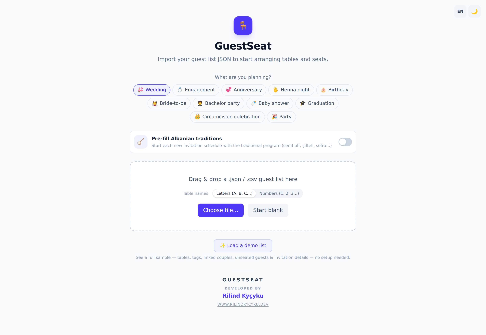 |  |
| **Floor plan** | **Guest editor** |
| 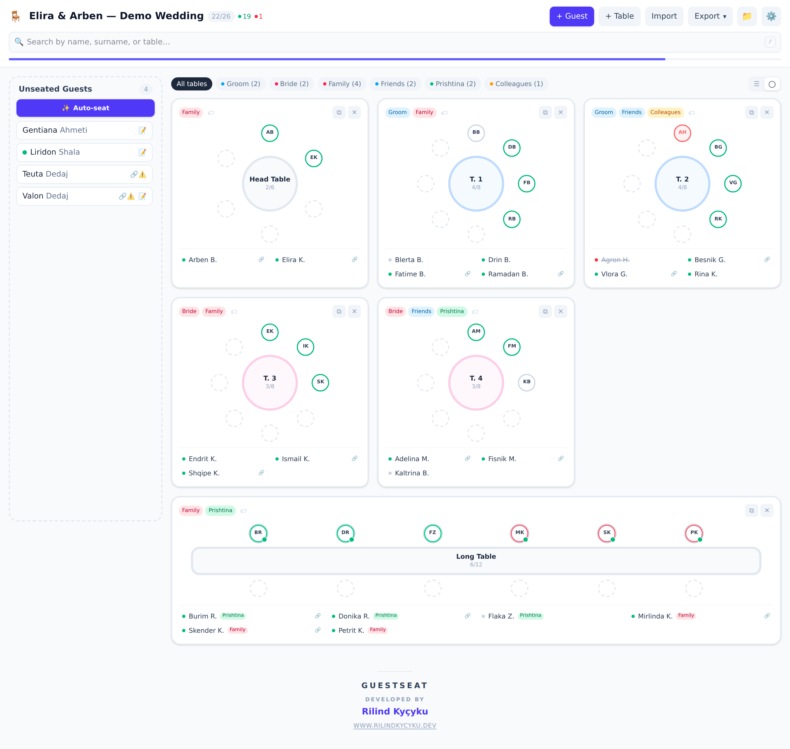 | 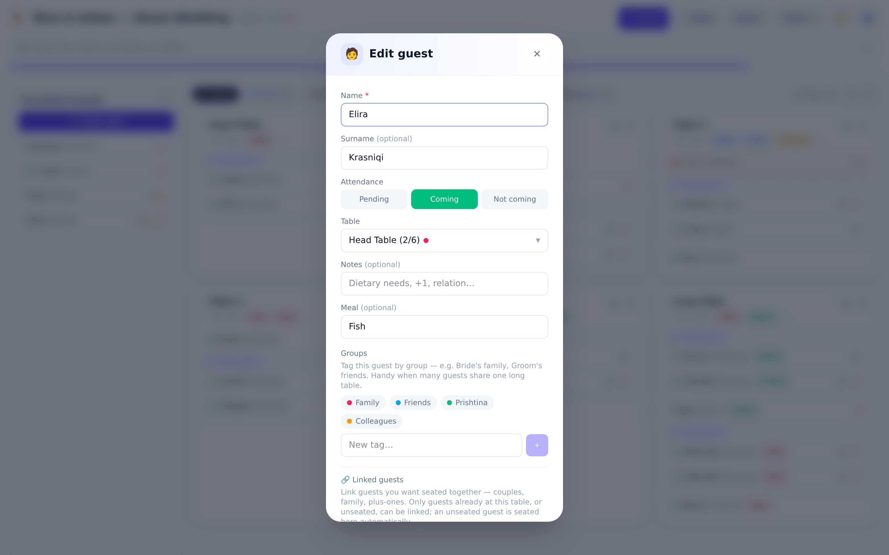 |
| **Invitation** | **QR share** |
| 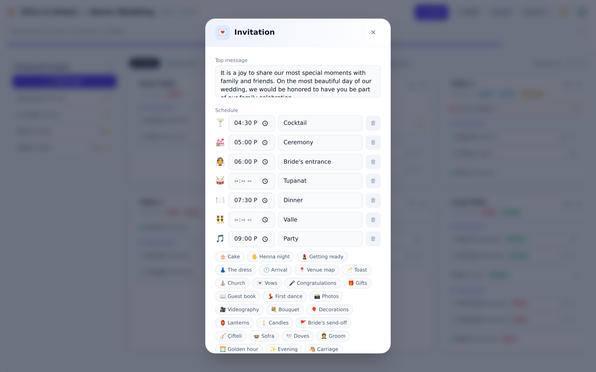 | 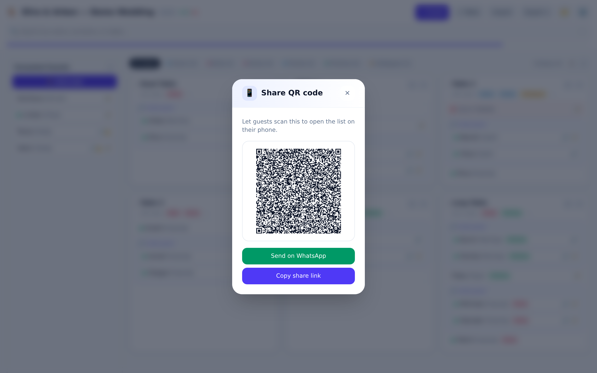 |
| **Overview & stats** | **Export menu** |
| 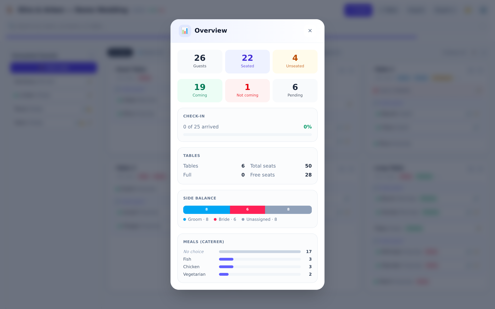 | 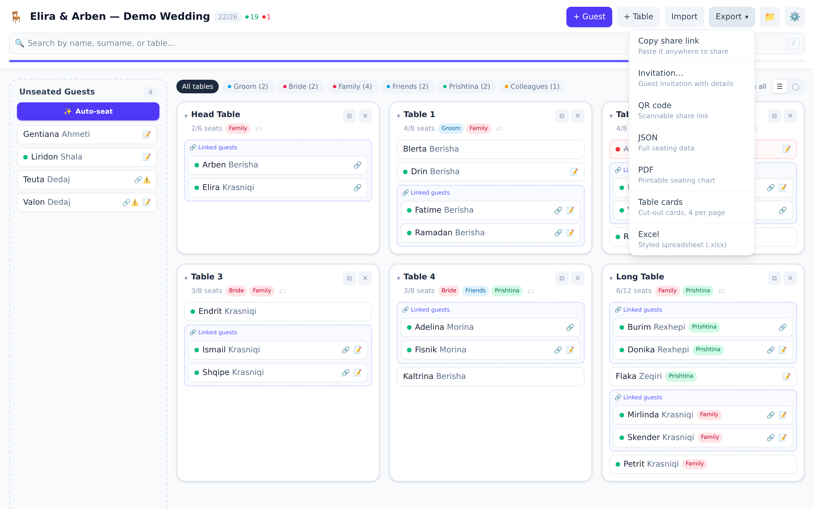 |
| **Settings** | **Dark mode** |
| 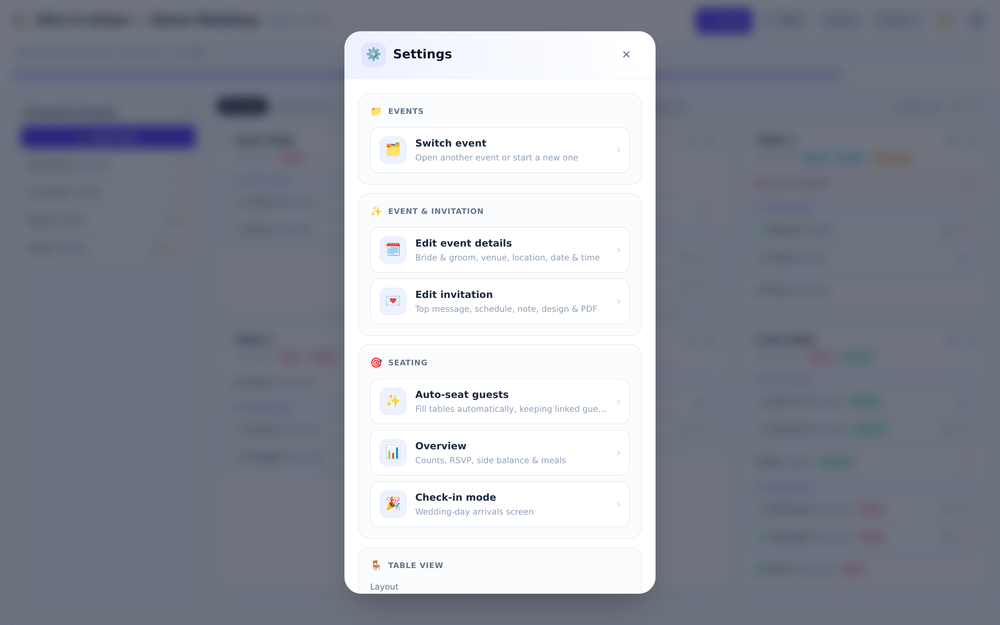 | 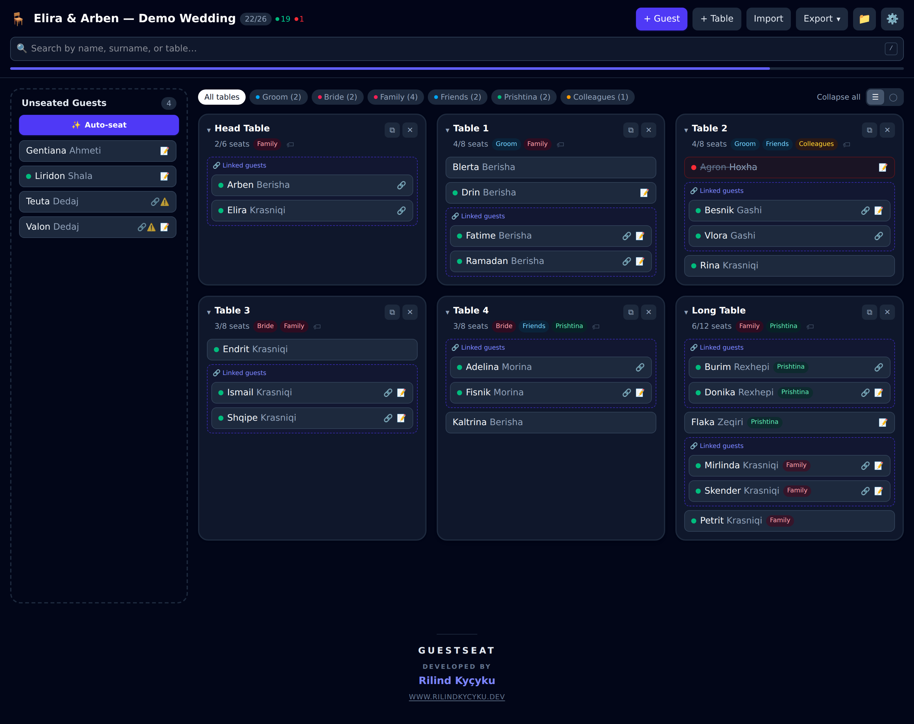 |

### 📱 On mobile

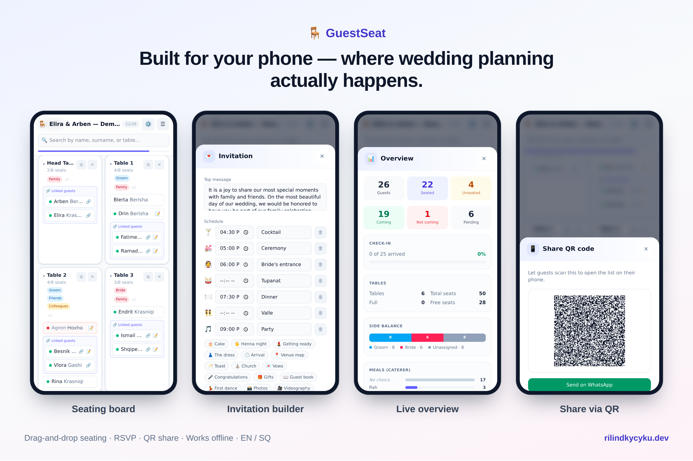

### 📄 Exports

The real, print-ready invitation and seating-chart PDFs:

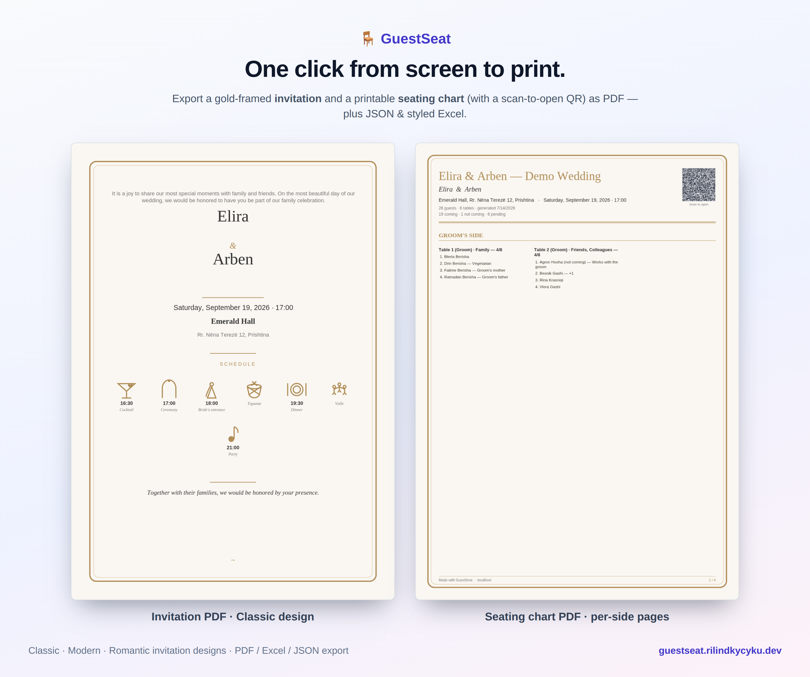

---

## 🛠️ Development

```bash
npm install
npm run dev
```

## 🔢 Versioning

The version shown in the app's footer lives only in `package.json` and is injected at build time
(`__APP_VERSION__`), so it can't drift from the number a release is tagged with.

`1.0` was the first working release, and every capability added since bumps the **minor** — grouped
by what shipped, not by how many pull requests it took, since several features here landed over five
or six PRs of iteration. [`CHANGELOG.md`](CHANGELOG.md) lists each release with the PRs it covers.

## ✅ Tests & checks

```bash
npm test        # Vitest — share-link codec, importers, auto-seating, board search, sync merge rules, backup files
npm run lint    # oxlint
npx tsc -b      # typecheck
```

CI runs all four (typecheck, lint, tests, build) on every push and pull request.

## 📦 Build

```bash
npm run build
npm run preview
```

---

*Made with ❤️ by [Rilind Kyçyku](https://github.com/rilindkycyku)*
